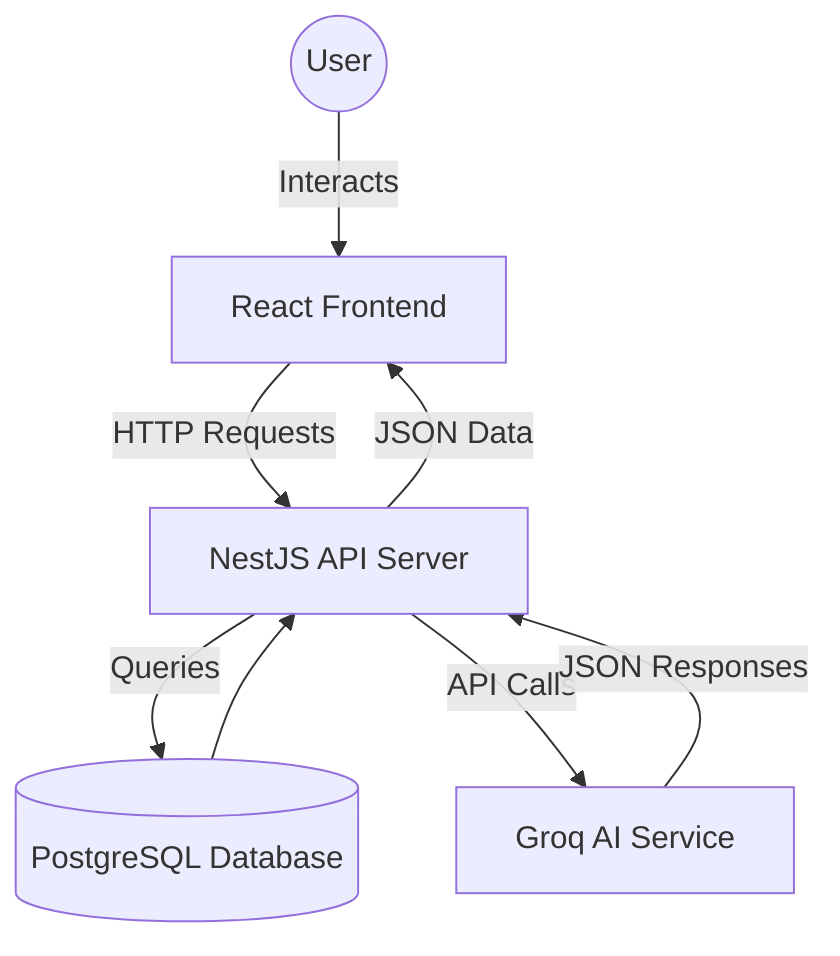
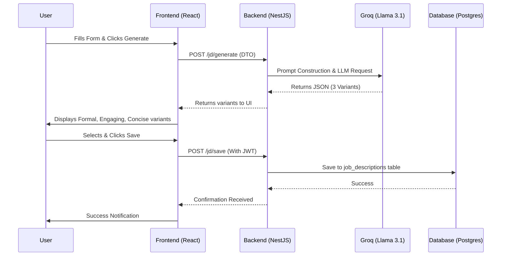

# JD Creation Project: Detailed Documentation

## 1. Project Overview
The **JD Creation Tool** is an AI-powered platform designed to streamline the recruitment process by automating the generation of high-quality, professional job descriptions. It leverages advanced LLMs (Large Language Models) to provide recruiters with multiple JD variants, intelligent skill suggestions, and automated quality audits.

### Core Value Proposition
- **Efficiency**: Reduces the time taken to write a JD from hours to seconds.
- **Quality**: Ensures JDs are professional, inclusive, and comprehensive.
- **Customization**: Offers multiple tones (Formal, Engaging, Concise) and iterative refinement.
- **Consistency**: Standardizes the format of JDs across the organization.

---

## 2. Requirements & Use Cases

### Functional Requirements
- **User Authentication**: Secure sign-up/sign-in using JWT.
- **AI-Powered Generation**: Generate JDs based on role, company, skills, and experience.
- **Variant Generation**: Provide 3 distinct tones for every generation request.
- **Intelligent Suggestions**: Auto-suggest skills and auto-fill responsibilities/qualifications.
- **JD Refinement**: Modify existing JDs using natural language instructions.
- **Quality Audit**: Evaluate JDs based on score, grade, and actionable suggestions.
- **Persistence**: Save, view, and delete JDs for future use.

### Technical Requirements
- **Decoupled Architecture**: Separate frontend and backend services.
- **AI Integration**: Integration with high-performance LLMs (Groq/Llama).
- **Robust Data Handling**: Structured JSON responses from AI with error fallback.
- **Relational Storage**: Persistent storage for users and saved JDs.

### Use Cases
- **Technical Recruiters**: Quickly drafting complex software engineering JDs.
- **HR Managers**: Standardizing job postings across different departments.
- **Hiring Managers**: Refining JDs to match specific team cultures.
- **Startup Founders**: Building high-quality hiring documents with minimal HR resources.

---

## 3. Technology Stack

### Frontend (Client-Side)
- **Framework**: React 19 (managed with Vite)
- **State Management**: React Context (AuthContext)
- **Styling**: Vanilla CSS (Premium, custom-built design system)
- **API Communication**: Axios
- **Form Handling**: Custom state-driven forms in `JDForm.tsx`

### Backend (Server-Side)
- **Framework**: NestJS (TypeScript)
- **Database ORM**: TypeORM
- **Database**: PostgreSQL
- **AI Engine**: Groq Cloud API (Model: `llama-3.1-8b-instant`)
- **Authentication**: Passport.js with JWT Strategy
- **Documentation**: Swagger/OpenAPI (built-in NestJS)

---

## 4. Workflow

### Standard User Journey
1. **Authentication**: User logs in or creates an account.
2. **Setup**: User selects a JD template or enters a Job Title and Experience Level.
3. **Drafting (Optional AI Assist)**:
   - Click "AI Suggest Skills" to get role-specific technical and soft skills.
   - Click "Auto-Fill" to generate baseline Responsibilities and Qualifications.
4. **Generation**: User clicks "Generate JD" to produce 3 variants (Formal, Engaging, Concise).
5. **Selection & Refinement**:
   - User chooses a variant.
   - User provides instructions (e.g., "Make it sound more like a startup" or "Add information about remote work benefits") to refine the text.
6. **Quality Check**: User runs a quality audit to see the score and areas for improvement.
7. **Saving**: User saves the final JD to their dashboard.
8. **Management**: User can access their library of saved JDs anytime.

---

## 5. Architecture & Flow Structure

### High-Level Architecture

### Data Flow Structure
The following diagram illustrates the flow of a "Generate JD" request:

---

## 6. Implementation Highlights
- **Parallel Generation**: Variants are generated in a single LLM call using structured prompts for efficiency.
- **Robust JSON Parsing**: The backend includes logic to extract JSON from AI responses even if the model adds preamble or formatting mistakes.
- **State Management**: React Context ensures that a user's session is maintained globally across the dashboard and JD creator.
- **Premium UI**: Custom CSS variables and components ensure a modern, professional look without the overhead of heavy CSS frameworks.
