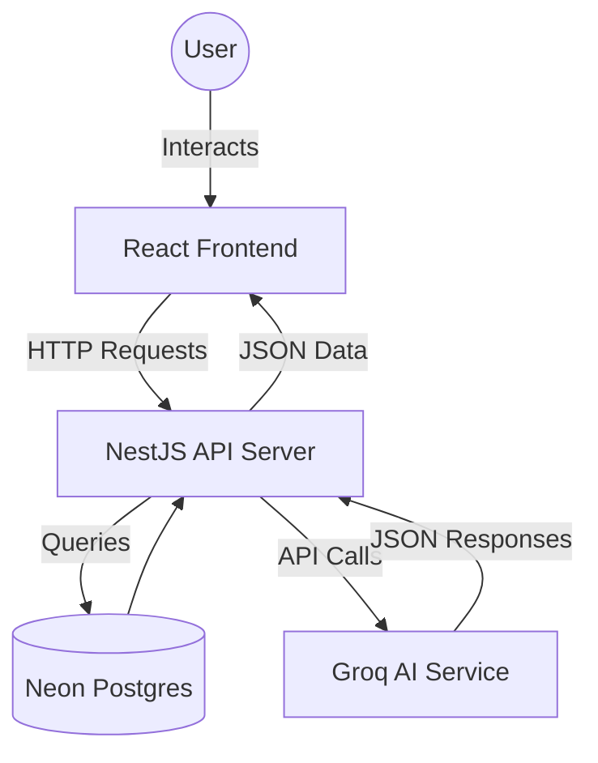
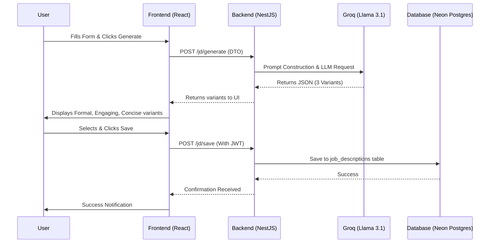

# JD Creation Project: Detailed Documentation
*Last Updated: 2026-03-21*

## 1. Project Overview
The **JD Creation Tool** is an AI-powered platform designed to streamline the recruitment process by automating the generation of high-quality, professional job descriptions. It leverages advanced LLMs (Large Language Models) to provide recruiters with multiple JD variants, intelligent skill suggestions, and automated quality audits.

### Core Value Proposition
- **Efficiency**: Reduces the time taken to write a JD from hours to seconds.
- **Quality**: Ensures JDs are professional, inclusive, and comprehensive.
- **Customization**: Offers multiple tones (Formal, Engaging, Concise) and iterative refinement.
- **Consistency**: Standardizes the format of JDs across the organization.

---

## 2. Requirements & Use Cases

### Functional Requirements
- **User Authentication**: Secure sign-up/sign-in using JWT and Passport.js.
- **AI-Powered Generation**: Generate JDs based on role, company, skills, and experience.
- **Variant Generation**: Provide 3 distinct tones (Formal, Engaging, Concise) for every generation request.
- **Intelligent Suggestions**: Auto-suggest skills based on the job title and experience.
- **Auto-Fill Logic**: Automatically draft baseline responsibilities and qualifications.
- **JD Refinement**: Modify existing JDs using natural language instructions.
- **Quality Audit**: Evaluate JDs based on score, grade, and actionable suggestions.
- **Persistence**: Save, view, and delete JDs for future use in a personal dashboard.

### Technical Requirements
- **Decoupled Architecture**: Separate React frontend and NestJS backend.
- **AI Integration**: Integration with Groq Cloud API (Llama 3.1 8B Instant).
- **Cloud Database**: Persistent storage using Neon PostgreSQL.
- **Robust Data Handling**: Structured JSON responses from AI with automated parsing and fault tolerance.

### Use Cases
- **Technical Recruiters**: Quickly drafting complex software engineering JDs.
- **HR Managers**: Standardizing job postings across different departments.
- **Hiring Managers**: Refining JDs to match specific team cultures.
- **Startup Founders**: Building high-quality hiring documents with minimal HR resources.

---

## 3. Technology Stack

### Frontend (Client-Side)
- **Framework**: React 19 (managed with Vite)
- **State Management**: React Context (AuthContext) for session persistence.
- **Styling**: Vanilla CSS (Premium, custom-built design system with modern aesthetics).
- **API Communication**: Axios with interceptors for JWT injection.

### Backend (Server-Side)
- **Framework**: NestJS (Modular Architecture)
- **Database ORM**: TypeORM
- **Database**: PostgreSQL (Hosted on Neon Cloud)
- **AI Engine**: Groq Cloud API (Model: `llama-3.1-8b-instant`)
- **Authentication**: Passport.js with JWT Strategy and Bcrypt for password hashing.
- **Documentation**: Swagger/OpenAPI for API discovery.

---

## 4. Workflow

### Standard User Journey
1. **Authentication**: User logs in or creates a new account.
2. **Dashboard**: User views previously saved JDs or starts a new creation.
3. **Setup**: User enters Job Title, Company, Experience, and Location (or uses a Template).
4. **Drafting (AI Assist)**:
   - Click "AI Suggest Skills" to get role-specific technical/soft skill chips.
   - Click "Auto-Fill" to generate baseline bullet points for Responsibilities and Qualifications.
5. **Generation**: User clicks "Generate JD" to produce 3 variants.
6. **Selection & Refinement**:
   - User chooses a variant.
   - User provides natural language instructions (e.g., "Add a focus on remote work") to refine the text.
7. **Quality Check**: User runs an automated audit to receive a score and feedback.
8. **Saving**: User saves the final JD to their library.

---

## 5. Architecture & Flow Structure

### High-Level Architecture

### Data Flow Structure
The following diagram illustrates the flow of a "Generate JD" request:

---

## 6. Implementation Highlights
- **Cloud-Native Database**: Optimized for Neon PostgreSQL with SSL and connection pooling.
- **Parallel Variant Generation**: 3 variants generated in a single LLM pass for better UX.
- **Iterative Refinement**: High-precision AI logic that respects user instructions while maintaining document structure.
- **Automated Quality Audits**: Real-time feedback loop for recruiters to improve job postings.
- **Responsive Premium Design**: Mobile-friendly dashboard with glassmorphism and smooth micro-animations.
