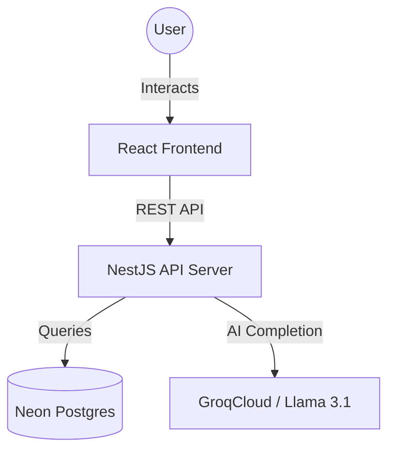

# JD Creator Tool: AI-Powered Job Description Generator

A professional full-stack platform designed to streamline recruitment by automating the generation, refinement, and auditing of job descriptions using Llama 3.1 AI.

## 🚀 Key Features

- **AI-Powered Generation**: Generate 3 distinct JD variants (Formal, Engaging, Concise) in seconds.
- **Intelligent Skill Suggestions**: Get role-specific technical and soft skill recommendations.
- **Auto-Fill Details**: Automatically draft core responsibilities and qualifications.
- **AI JD Refinement**: Refine generated JDs using natural language instructions (e.g., "Make it more startup-focused").
- **Quality Audit**: Automated evaluation with a quality score, grade, and actionable improvement suggestions.
- **Saved JDs Management**: Save, view, and manage your library of job descriptions.
- **Role Templates**: Pre-configured templates for Technology, Business, Creative, and Operations domains.

## 🛠️ Tech Stack

### Frontend
- **React 19** with **Vite**
- **TypeScript**
- **Vanilla CSS** (Premium Design System)
- **Axios** (API Communication)
- **React Context** (Auth & Global State)

### Backend
- **NestJS** (Modular Architecture)
- **TypeORM** (Database ORM)
- **PostgreSQL** (Managed via Neon)
- **Groq Cloud API** (AI Engine: Llama 3.1 8B Instant)
- **Passport.js & JWT** (Secure Authentication)

---

## 🏗️ Architecture

The project follows a decoupled client-server architecture:



---

## 🛠️ Getting Started

### Prerequisites
- Node.js (v18+)
- PostgreSQL (Local or Neon)
- Groq Cloud API Key

### Installation

1. **Clone the repository**
   ```bash
   git clone https://github.com/Abhaykalshetti/JD-creator-project.git
   cd JD-creator-project
   ```

2. **Backend Setup**
   ```bash
   cd backend
   npm install
   ```
   Create a `.env` file in the `backend` folder:
   ```env
   DATABASE_URL=your_postgres_url
   GROQ_API_KEY=your_groq_api_key
   JWT_SECRET=your_jwt_secret
   PORT=3000
   CORS_ORIGIN=http://localhost:5173
   ```
   Run the backend:
   ```bash
   npm run start:dev
   ```

3. **Frontend Setup**
   ```bash
   cd ../frontend
   npm install
   ```
   Create a `.env` file in the `frontend` folder:
   ```env
   VITE_API_URL=http://localhost:3000
   ```
   Run the frontend:
   ```bash
   npm run dev
   ```

---

## 📂 Project Structure

- `frontend/`: React application, UI components, and styles.
- `backend/`: NestJS modules, controllers, services, and database entities.
- `PROJECT_DOCUMENTATION.md`: Detailed functional specs and workflows.
- `project_architecture_details.md`: Deep dive into system design and AI logic.

## 📄 License

This project is [UNLICENSED](LICENSE).

---
Developed by **Abhay Kalshetti**
