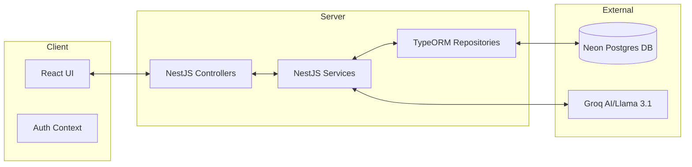

# JD Creation Project Architecture & Functionality Document
*Current Status: Active Development (Updated 2026-03-21)*

## 1. Project Overview
The JD Creation Project is a full-stack platform designed to automate and enhance the recruitment workflow. It leverages the Llama 3.1 8B model (via Groq Cloud API) to generate, refine, and audit job descriptions based on user inputs and industry best practices.

## 2. Architecture & Tech Stack
The application is strictly decoupled, allowing for independent scaling and maintenance of the client and server.

**Frontend:**
- **Framework:** React 19 (Vite)
- **Styling:** Custom Vanilla CSS with a focus on premium, modern aesthetics (Dark Mode optimized).
- **Identity:** JWT-based session management using React Context.
- **Components:** Modular structure (Auth, JD Form, Landing Page, Saved JDs).

**Backend:**
- **Framework:** NestJS (Modular, TypeScript-first).
- **Runtime:** Node.js.
- **Database:** Neon PostgreSQL (Cloud Managed).
- **ORM:** TypeORM.
- **AI Integration:** Groq API using OpenAI's high-speed completion interface.

## 3. Core Functionality & Logic

### A. Role Templates
- Predefined domain states (Technology, Business, Creative, Operations).
- Instant state override on the frontend to speed up repetitive JD creation.

### B. AI Skill Suggestions (`/jd/suggest-skills`)
- Acts as a technical recruiter persona.
- Analyzes job title and experience to suggest technical, soft, and tool-specific skills.
- Returns clickable chips that dynamically update the "Required Skills" list.

### C. Auto-Fill Details (`/jd/suggest-req-qual`)
- Generates industry-standard responsibilities and qualifications.
- Prevents "blank page syndrome" by providing a solid baseline for the recruiter to edit.

### D. Multi-Variant Generation (`/jd/generate`)
- Generates **Formal**, **Engaging**, and **Concise** variants in parallel.
- Logic is encapsulated in `JdService`, handling prompt construction and multi-output parsing.

### E. Natural Language Refinement (`/jd/refine`)
- A powerful iterative tool where users can "talk" to their JD.
- Example: "Add a section about our unlimited vacation policy" or "Make the language more inclusive".
- Preserves the core structure while applying targeted modifications.

### F. Automated Quality Audit (`/jd/check-quality`)
- Analyzes JD text against specific criteria: Clarity, Completeness, Conciseness, and Candidate Appeal.
- Returns a numerical score, a grade, and 3-5 specific, actionable suggestions for improvement.

### G. Persistent Dashboard
- Users can save their variants to Neon Postgres.
- Full CRUD capability: Create, Read (List/Detail), and Delete.
- All saved records are tied to the authenticated user's ID.

## 4. System Design Diagram

