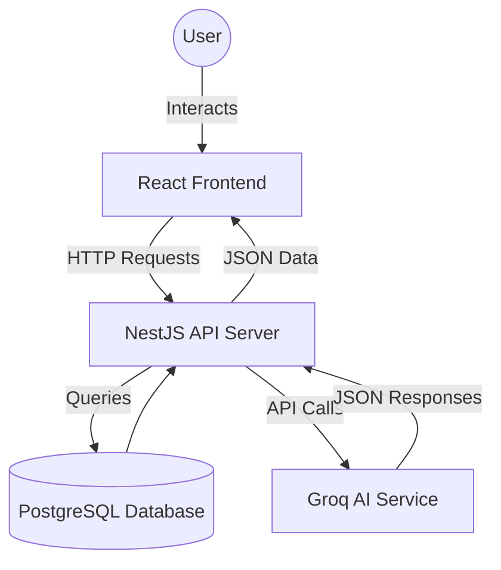
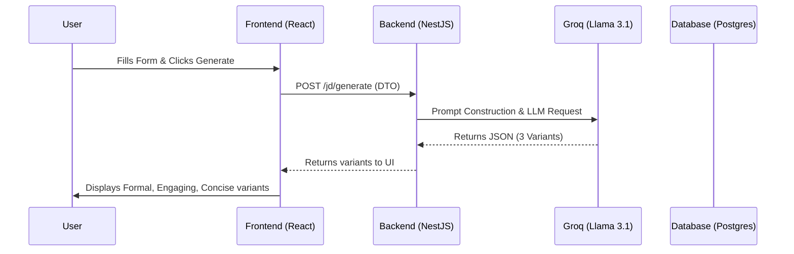

# Project Documentation Walkthrough

I have completed the detailed documentation for the JD Creation project. The documentation is located at [PROJECT_DOCUMENTATION.md](file:///d:/JD-Creation-project/PROJECT_DOCUMENTATION.md).

## Highlights of the Documentation

### 1. Project Overview & Tech Stack
The document provides a clear explanation of the tool's purpose and the modern tech stack used, including **NestJS**, **React 19**, and the **Groq AI Engine**.

### 2. Workflow & Flow Structure
I have detailed the step-by-step user journey, from authentication to saving a refined JD.

### 3. Architecture Diagrams
I have included Mermaid diagrams to visualize the system architecture and the data flow for JD generation.

#### System Architecture

#### Generation Data Flow

## How to View
You can open the [PROJECT_DOCUMENTATION.md](file:///d:/JD-Creation-project/PROJECT_DOCUMENTATION.md) file in your IDE to see the full content with rendered diagrams.
